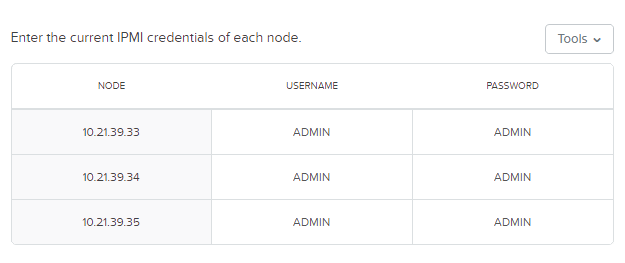
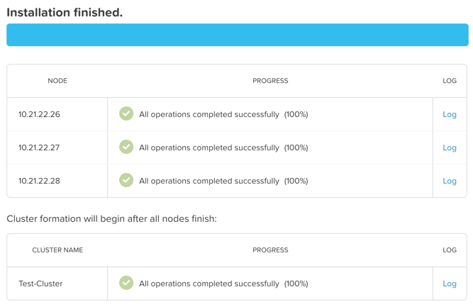

.. _diyfoundation_lab:

----------
Foundation
----------

Overview
++++++++

.. note::

  Estimated time to complete: **90 Minutes**

  This lab requires a Nutanix Hosted POC (HPOC) reservation. "Nested" clusters are not supported. Hypervisor and AOS version for the reservation do not matter.

  It is highly recommended to use a virtual desktop provided as part of your HPOC reservation to perform this lab. Using the virtual desktop will localize the transfer of large files (such as AOS and hypervisor binaries) to your Foundation VM.

  Unless otherwise directed by support, always use the latest version of Foundation.

Foundation is used to automate the installation of the hypervisor and Controller VM on one or more nodes. In this exercise you will practice imaging a physical cluster with Foundation. In order to keep the lab self-contained, you will create a single node "cluster" on which you will deploy your Foundation VM. That Foundation instance will be used to image and create a cluster from the remaining 3 nodes in the Block.

Refer to the Nutanix `Field Installation Guide <https://portal.nutanix.com/#/page/docs/details?targetId=Field-Installation-Guide-v4-0:Field-Installation-Guide-v4-0>`_ for additional instruction on configuring your local environment (Oracle VirtualBox, VMware Fusion, etc.) to run your Foundation VM.

References and Downloads
........................

- `Field Installation Guide <https://portal.nutanix.com/#/page/docs/details?targetId=Field-Installation-Guide-v4-0:Field-Installation-Guide-v4-0>`_ - *Comprehensive Foundation documentation, including steps for local deployment of Foundation VM.*
- `Foundation Release Notes <https://portal.nutanix.com/#/page/docs/details?targetId=Field-Installation-Guide-Rls-Notes-v4-0:Field-Installation-Guide-Rls-Notes-v4-0>`_ - *Fixes, known issues, enhancements, and upgrade information.*
- `NX Hardware System Specifications <https://portal.nutanix.com/#/page/docs/list?type=hardware>`_ - *Helpful for determining LAN/IPMI/Shared ports for different hardware platforms.*
- `Foundation binaries and related files <https://portal.nutanix.com/#/page/foundation>`_ - *Downloads for baremetal Foundation, CVM Foundation, and ISO whitelist.*
- `KB2430 <https://portal.nutanix.com/#/page/kbs/details?targetId=kA032000000TT1HCAW>`_ - *Internal Only KB detailing how to download old versions of AOS/AHV that are no longer available on Nutanix Portal.*
- `vSphere Administration Guide for Acropolis <https://portal.nutanix.com/#/page/docs/details?targetId=vSphere-Admin6-AOS-v56:vSphere-Admin6-AOS-v56>`_ - *Includes post-install steps for configuring HA/DRS on vSphere.*

Cabling Your Hardware
+++++++++++++++++++++

.. note::

  The following lab will be performed with a cluster in the Nutanix Hosted POC environment. The information on cabling below is for reference when performing a physical, baremetal Nutanix installation.

Foundation requires connectivity to **both** the standard network interface of a node and the Baseboard Management Controller (BMC) network interface. The BMC, called **IPMI** on Nutanix NX nodes, is a dedicated system present in every enterprise server platform used for out of band management. Other supported platforms use different names for IPMI, such as iDRAC on Dell, IMM on Lenovo, and iLO on HPE.

Referring to the example diagram below, there are two options for cabling Nutanix nodes prior to imaging with Foundation:

- Using two cables per node, one connected to either onboard LAN port and one connected to the dedicated IPMI port.
- Using one cable per node, connected to the **Shared IPMI** port. With only the **Shared** port connected, it is capable of intelligently forwarding traffic to either the IPMI or LAN interface, allowing Foundation to communicate with both interfaces simultaneously.

.. note::

  During node power off/on the Shared port on certain platforms may switch between 100Mb and 1Gb speeds, which can cause issues if your switch cannot auto-negotiate to the proper speed.

  Additionally, for nodes such as the NX-3175 which only have 10Gb SFP+ onboard NICs, the 1Gb transceiver used to connect to your flat switch requires electrical power. That power is only available when the node is powered on, making it critical to use two cables per node in this situation.

  Overall, if there are sufficient cables and ports available, using two cables per node is preferred.

Both the nodes and the host used to run the Foundation VM should be connected to the same flat switch. If imaging on a customer switch, ensure that any ports used are configured as **Access** or **Untagged**, or that a **Native** VLAN has been configured.

Refer to the appropriate `manufacturer's hardware documentation <https://portal.nutanix.com/#/page/docs/list?type=hardware>`_ to determine the locations of the **IPMI** and **Shared** ports.

Staging Your Environment
++++++++++++++++++++++++

A Hosted POC reservation provides a fully imaged cluster consisting of 4 nodes. To keep the lab self-contained within a single, physical block, you will:

- Destroy the existing cluster
- Create a single node "cluster" using Node A
- Install the Foundation VM on Node A
- Use Foundation to image Nodes B, C, and D and create a 3 node cluster

Using an SSH client, connect to the **Node A CVM IP** (e.g. 10.21.\ *XYZ*\ .29) in your assigned block using the following credentials:

- **Username** - nutanix
- **Password** - *<HPOC Cluster Password>*

Execute the following commands to power off any running VMs on the cluster, stop cluster services, and destroy the existing cluster:

.. code-block:: bash

  acli -y vm.off \*
  cluster stop        # Enter 'Y' when prompted to proceed
  cluster destroy     # Enter 'Y' when prompted to proceed

Replacing the **Node A CVM IP**, execute the following to manually create the cluster:

.. code-block:: bash

  cluster --cluster_name=FoundationLab --dns_servers=10.21.253.10 --ntp_servers=10.21.253.10 --svm_ips=<NODE A CVM IP> create

.. note::

  The above command will create a "cluster" from a single node using RF1, offering no redundancy to recover from hardware failure. This configuration is being used for non-production, instructional purposes and should **NEVER** be used for a customer deployment.

  After the "cluster" is created, Prism will reflect Critical Health status due to lack of redundancy.

  .. figure:: images/0.png

Open \https://*<NODE A CVM IP>*:9440 in your browser and log in with the following credentials:

- **Username** - admin
- **Password** - Nutanix/4u

Provide a new **admin** password that conforms to the displayed password policy. Log in as **admin** using your new password.

Accept the EULA and Pulse prompts.

Installing Foundation
+++++++++++++++++++++

In **Prism**, click :fa:`cog` **> Image Configuration > + Upload Image**.

Fill out the following fields and click **Save**:

- **Name** - Foundation
- **Image Type** - Disk
- **Storage Container** - default-container
- Select **From URL**
- **Image Source** - http://download.nutanix.com/foundation/foundation-4.2.1/Foundation_VM-4.2.1-disk-0.qcow2

.. note::

  At the time of writing, Foundation 4.2.1 is the latest available version. The URL for the latest Foundation VM QCOW2 image can be downloaded from the `Nutanix Portal <https://portal.nutanix.com/#/page/foundation>`_.

  **Unless otherwise directed by support, always use the latest version of Foundation.**

After the image creation process completes, browse to **Prism > VM > Table** and click **Network Config**.

Before creating the VM, we must first create a virtual network to assign to the Foundation VM. The network will use the Native VLAN assigned to the physical uplinks for all 4 nodes in the block.

Click **Virtual Networks > Create Network**.

Fill out the following fields and click **Save**:

- **Name** - Primary
- **VLAD ID** - 0

In **Prism > VM > Table** and click **+ Create VM**.

Fill out the following fields and click **Save**:

- **Name** - Foundation
- **vCPU(s)** - 2
- **Number of Cores per vCPU** - 1
- **Memory** - 4 GiB
- Select **+ Add New Disk**

  - **Operation** - Clone from Image Service
  - **Image** - Foundation
  - Select **Add**
- Select **Add New NIC**

  - **VLAN Name** - Primary
  - Select **Add**

Select your **Foundation** VM and click **Power on**.

Once the VM has started, click **Launch Console**.

Once the VM has finished booting, click **nutanix**. Enter the default password and click **Log In**.

.. figure:: images/1.png

Double-click **set_foundation_ip_address > Run in Terminal**.

Select **Device configuration** and press **Return**.

.. figure:: images/2.png

Select **eth0** and press **Return**.

.. figure:: images/3.png

.. note:: Use the arrow keys to navigate between menu items.

Replacing the octet(s) that correspond to your HPOC network, fill out the following fields, select **OK** and press **Return**:

- **Use DHCP** - Press **Space** to de-select
- **Static IP** - 10.21.\ *XYZ*\ .41
- **Netmask** - 255.255.255.128
- **Gateway** - 10.21.\ *XYZ*\ .1

.. note::

  The Foundation VM IP address should be in the same subnet as the target IP range for the CVM/hypervisor of the nodes being imaged. As Foundation is typically performed on a flat switch and not on a production network, the Foundation IP can generally be any IP in the target subnet that doesn't conflict with the CVM/hypervisor/IPMI IP of a targeted node.

Select **Save** and press **Return**.

.. figure:: images/5.png

Select **Save & Quit** and press **Return**.

.. figure:: images/6.png

Running Foundation
++++++++++++++++++

From within the Foundation VM console, launch **Nutanix Foundation** from the desktop.

.. note::

  Foundation can be accessed via any browser at \http://*<Foundation VM IP>*:8000/gui/index.html

On the **Start** page, click **Next**.

.. note::

  Foundation node/cluster settings can optionally be pre-configured using https://install.nutanix.com and imported from the **Start** page.

Click **Click here** to manually specify the MAC address of your assigned node.

.. note::

  Foundation will automatically discover any hosts in the same IPv6 Link Local broadcast domain that is not already part of a cluster.

  .. figure:: images/8.png

  When transferring POC assets in the field, it's not uncommon to receive a cluster that wasn't properly destroyed at the conclusion of the previous POC. In this lab, the nodes are already part of existing clusters and will not be discovered.

Replacing the octet(s) that correspond to your HPOC network, fill out the following fields and select **Next**:

- **IPMI IP** - 10.21.\ *XYZ*\ .34
- **Hypervisor IP** - 10.21.\ *XYZ*\ .26
- **CVM IP** - 10.21.\ *XYZ*\ .30
- **Node B Hypervisor Hostname** - POC\ *XYZ*\ -2
- **Node C Hypervisor Hostname** - POC\ *XYZ*\ -3
- **Node D Hypervisor Hostname** - POC\ *XYZ*\ -4

Fill out the following fields and click **Next**:

- **Cluster Name** - Test-Cluster

  *Cluster Name is a "friendly" name that can be easily changed post-installation. It is common to create a DNS A record of the Cluster Name that points to the Cluster Virtual IP.*
- **NTP Servers of Every Hypervisor and CVM** - 10.21.253.10
- **DNS Servers of Every Hypervisor and CVM** - 10.21.253.10

  *DNS and NTP servers should be captured as part of install planning with the customer.*
- **Cluster Virtual IP** - 10.21.\ *XYZ*\ .37

  *Cluster Virtual IP needs to be within the same subnet as the CVM/hypervisor.*
- **Cluster Redundancy Factor** - 2

  *Redundancy Factor 2 requires a minimum of 3 nodes, Redundancy Factor 3 requires a minimum of 5 nodes. Cluster creation during Foundation will fail if the appropriate minimum is not met.*
- **Timezone of Every Hypervisor and CVM** - America/Los_Angeles
- **Netmask of Every IPMI** - 255.255.255.128
- **Netmask of Every Hypervisor and CVM** - 255.255.255.128
- **Gateway of Every IPMI** - 10.21.\ *XYZ*\ .1
- **Gateway of Every Hypervisor and CVM** - 10.21.\ *XYZ*\ .1
- **vRAM Allocation for Every CVM, in Gigabytes** - 32

  *Refer to AOS Release Notes > Controller VM Memory Configurations for guidance on CVM Memory Allocation.*

.. note::

  When imaging a cluster with Foundation, the CVMs and hypervisor management IP addresses must be in the same subnet. IPMI IP addresses can be in the same, or different, subnet. If IPMI will not be in the same subnet as CVM/hypervisor, Foundation can be configured to use different IP addresses for IPMI and CVM/hypervisor while on a flat, L2 network. Be careful to avoid duplicate IP address when specifying the **IP of the Interface for the Hypervisor-CVM Subnet**.

  .. figure:: images/13.png

Download your desired AOS package from the `Nutanix Portal <https://portal.nutanix.com/#/page/releases/nosDetails>`_.

By default, Foundation does not have any AOS or hypervisor images. To upload AOS or hypervisor files, click **Manage AOS Files**.

.. figure:: images/14.png

.. note::

  If downloading the AOS package within the Foundation VM, the .tar.gz package can also be moved to ~/foundation/nos rather than uploaded to Foundation through the web UI. After moving the package into the proper directory, click **Manage AOS Files > Refresh**.

Click **+ Add > Choose File**. Select your downloaded *nutanix_installer_package-release-\*.tar.gz* file and click **Upload**.

After the upload completes, click **Close**. Click **Next**.

Select a target hypervisor:

- :ref:`diyfoundation_lab_ahv`
- :ref:`diyfoundation_lab_vsphere`
- :ref:`diyfoundation_lab_hyperv`

--------------------------------------------------------------

.. _diyfoundation_lab_ahv:

Using AHV
.........

Fill out the following fields and click **Next**:

- **Select a hypervisor installer** - AHV, AHV installer bundled inside the AOS installer

.. note::

  Every AOS release contains a version of AHV bundled with that release.

.. note::

  When selecting an alternate hypervisor (ESXi, Hyper-V, XenServer) you can use this page to upload installation ISO files and, if necessary, modified whitelists.

Continue to :ref:`diyfoundation_lab_posthypervisor`.

.. _diyfoundation_lab_vsphere:

Using vSphere
.............

*Coming soon*

.. _diyfoundation_lab_hyperv:

Using Hyper-V
.............

*Coming soon*

--------------------------------------------------------------

.. _diyfoundation_lab_posthypervisor:

Post-Hypervisor Configuration
.............................

Select **Fill with Nutanix defaults** from the **Tools** dropdown menu to populate the credentials used to access IPMI on each node.

.. note:: When performing a baremetal Foundation in the field, ensure your laptop will not go to sleep due to inactivity.

Click **Start > Proceed** and continue to monitor Foundation progress through the Foundation web console. Click the **Log** link to view the realtime log output from your node.

Foundation will leverage IPMI (or the Out of Band Management standard for the given hardware platform, e.g. iDRAC, iLO, CIMC, etc.) to boot each node to a virtual CD image called Phoenix. The Phoenix image contains what are called "Layout Modules." Layout Modules provide critical hardware information to the installer, allowing Nutanix to support a wide range of hardware configurations (NX, Dell, Lenovo, IBM, Cisco, HPE, Klas, Crystal, etc.).

Phoenix will download the AOS and hypervisor binaries from the Foundation VM. Once Phoenix is booted on each node, Phoenix communicates with Foundation via the node's LAN connection. IPMI is only used for mounting the virtual CD image.

Phoenix will then perform an automated installation of the hypervisor (including any packaged drivers) to the appropriate boot media (SATADOM, SD Card, M.2 SSD) and writes the CVM filesystem to a dedicated partition on the first SSD in the system (NOT on the hypervisor boot media).

After these tasks are completed, the node reboots to the newly installed hypervisor. The hypervisor iterates through the SSDs to find out which SSD has the CVM, and then boots the CVM. Firstboot scripts are run to prepare the hypervisor and CVM on the node, including setting IP information.

When all CVMs are ready, Foundation initiates the cluster creation process.

Open \https://*<Cluster Virtual IP>*:9440 in your browser and log in with the following credentials:

- **Username** - admin
- **Password** - Nutanix/4u

