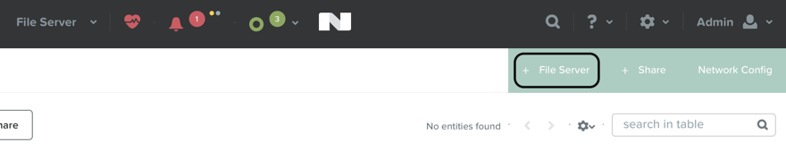
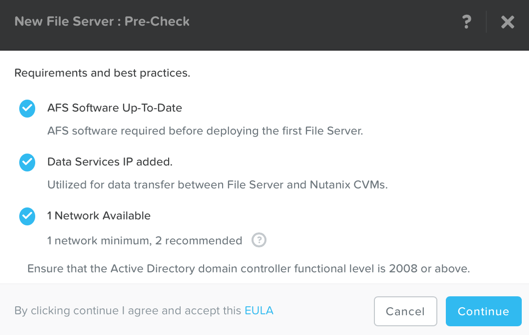
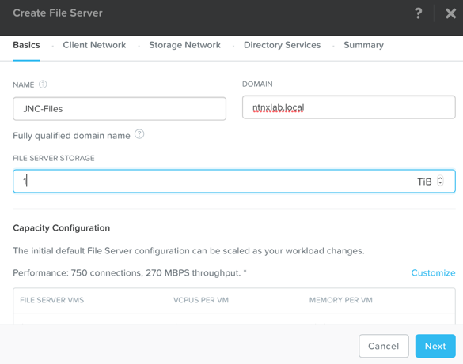
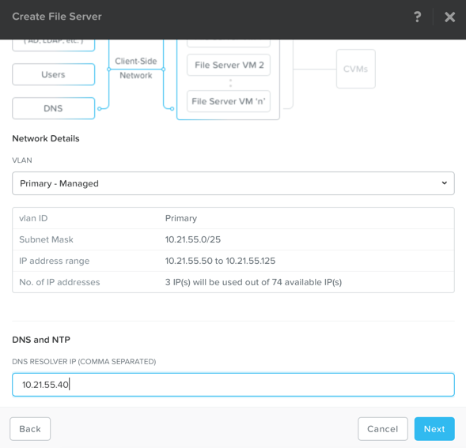
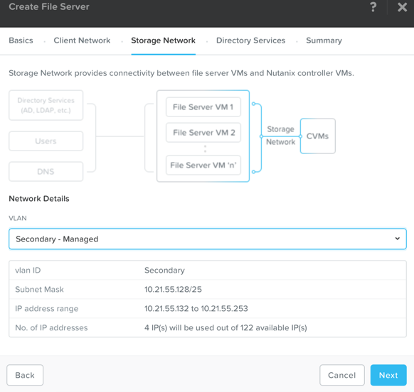
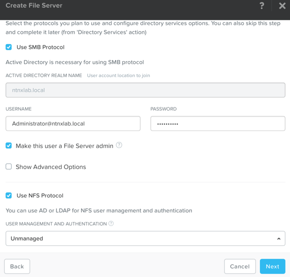
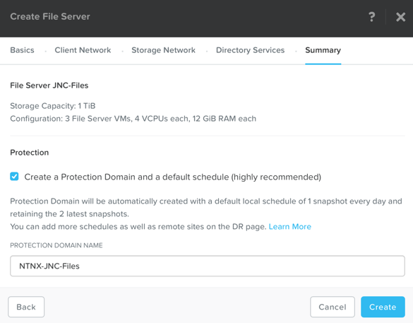
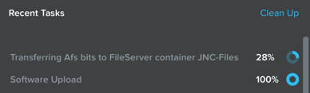
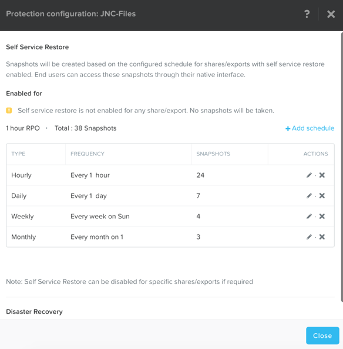

.. _files_deploy:

-------------
Files: Deploy
-------------

Overview
++++++++

.. note::

  Estimated time to complete: **1 HOUR**

In this exercise you will use Prism to deploy Files, a native, distributed file server solution for Nutanix clusters.

Deploy Files
++++++++++++

In **Prism > File Server**, click **+ File Server**.

The Files 3.1.0.1 package has already been uploaded and the Data Services IP has been configured as 10.21.XXX.38. Click **Continue**.

Fill out the following fields and click **Next**:

  - **Name** - *intials*-Files (e.g. JNC-Files)
  - **Domain** - ntnxlab.local
  - **File Server Size** - 1 TiB

.. note:: Clicking **Custom Configuration** will allow you to alter the scale up and scale out sizing of the Files VMs based on User and Throughput targets.

Select the **Primary - Managed** VLAN for the Client Network. Specify your cluster's **AutoDC** VM IP as the **DNS Resolver IP**. Click **Next**.

.. note::

  In order for the Files cluster to successfully find and join the **NTNXLAB.local** domain it is critical that the **DNS Resolver IP** is set to the **AutoDC** VM IP **FOR YOUR CLUSTER**. By default, this field is set to the primary **Name Server** IP configured for the Nutanix cluster, **this value is incorrect and will not work.**

Select the **Secondary - Managed** VLAN for the Storage Network. Click **Next**.

 .. note::

  It is typically desirable to deploy Files with dedicated networks for client and storage. By design, however, Files does not allow client connections from the storage network in this configuration.

Fill out the following fields and click **Next**:

  - Select **Use SMB Protocol**
  - **Username** - Administrator@ntnxlab.local
  - **Password** - nutanix/4u
  - Select **Make this user a File Server admin**
  - Select **Use NFS Protocol**
  - **User Management and Authentication** - Unmanaged

.. note:: Similar to NFSv3, in Unmanaged mode, users are only identified by UID/GID. NFS connections will still require an NFSv4 capable client.

Click **Next**.

Fill out the following fields and click **Create**:

  - Select **Create a Protection Domain and a default schedule (highly recommended)**
  - **PROTECTION DOMAIN NAME** - NTNX-JNC-Files

Monitor deployment progress in **Prism > Tasks**.

.. note::

  If you receive a warning regarding DNS record validation failure, this can be safely ignored. The shared cluster does not use the same DNS servers as your Files cluster, and as a result is unable to resolve the DNS entries created when deploying Files.

Upon completion, select the **AFS** server and click **Protect**.

Observe the default Self Service Restore schedules, this feature controls the snapshot schedule for Windows' Previous Versions functionality. Supporting Previous Versions allows end users to roll back changes to files without engaging storage or backup administrators. Note these local snapshots do not protect the file server cluster from local failures and that replication of the entire file server cluster can be performed to remote Nutanix clusters. Click **Close**.

Takeaways
+++++++++

  - Nutanix provides file services suitable for storing user profiles and application data via SMB or NFSv4.
  - AFS is capable of scaling up and out to meet workload requirements.
  - AFS has data protection built-in by leveraging native snapshots and replication. AFS 3.0 will also feature integration with 3rd party backup solutions.
