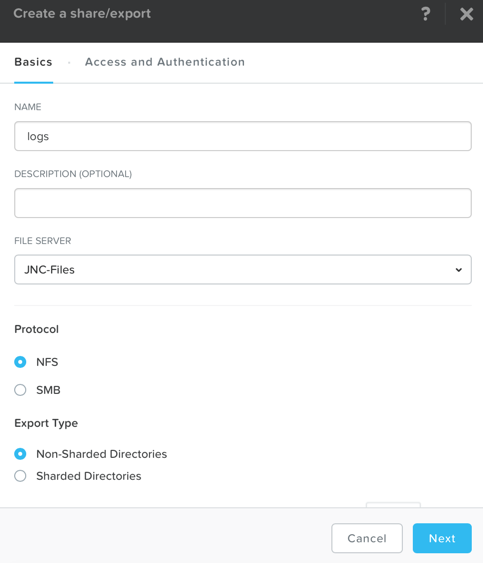
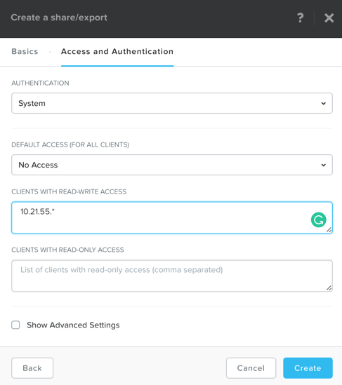
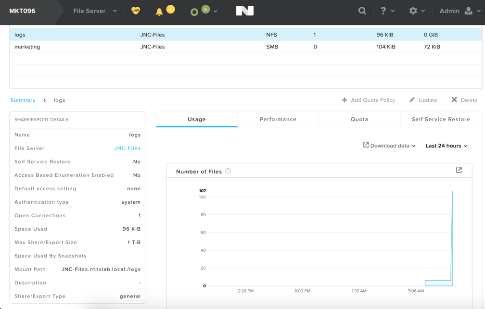

.. _files_nfs_export:

------------------------
Files: Create NFS Export
------------------------

Overview
++++++++

.. note::

  Estimated time to complete: **1 HOUR**

In this exercise you will use Files to configure a NFS share.

Configuring NFS Export
++++++++++++++++++++++

In **Prism > File Server**, click **+ Share/Export**. Fill out the following fields and click **Next**:

  - **Name** - logs
  - **Protocol** - NFS
  - **Share/Export Type** - Non-Sharded Directories

Fill out the following fields and click **Create**:

  - **Authentication** - System
  - **Default Access** - No Access
  - Select **+ Add Client Exceptions**
  - **Clients with Read-Write Access** - *<Cluster IP Range>* (ex. 10.21.XX.*)

Connect to NFS Export
+++++++++++++++++++++

Linux VM for NFS Client
.......................

Use the **Linux_VM-*initials* ** VM you created earlier in the "Deploying Workloads" lab.

If you have not deployed a Linux VM, follow this guide to deploy a CentOS7 VM:

In **Prism > VM > Table**, click **+ Create VM**.

Fill out the following fields and click **Save**:

- **Name** - NFS-Client-*intials*
- **Description** - CentOS VM for testing Files NFS export
- **vCPU(s)** - 2
- **Number of Cores per vCPU** - 1
- **Memory** - 4 GiB
- Select **+ Add New Disk**

  - **Operation** - Clone from Image Service
  - **Image** - CentOS7
  - Select **Add**
- Select **Add New NIC**

  - **VLAN Name** - Primary
  - Select **Add**

Select the **NFS-Client-*intials* ** VM and click **Power on**.

Install NFS Client & Mount NFS Export
.....................................

Locate your VM, click **Launch Console** and log in as **root** or connect via SSH.

Execute the following:

  .. code-block:: bash

    [root@CentOS ~]# yum install -y nfs-utils
    [root@CentOS ~]# mkdir /filesmnt
    [root@CentOS ~]# mount.nfs4 *intials*-Files.ntnxlab.local:/ /filesmnt/
    [root@CentOS ~]# df -kh
    Filesystem                      Size  Used Avail Use% Mounted on
    /dev/mapper/centos_centos-root  8.5G  1.7G  6.8G  20% /
    devtmpfs                        1.9G     0  1.9G   0% /dev
    tmpfs                           1.9G     0  1.9G   0% /dev/shm
    tmpfs                           1.9G   17M  1.9G   1% /run
    tmpfs                           1.9G     0  1.9G   0% /sys/fs/cgroup
    /dev/sda1                       494M  141M  353M  29% /boot
    tmpfs                           377M     0  377M   0% /run/user/0
    *intials*-Files.ntnxlab.local:/             1.0T  7.0M  1.0T   1% /afsmnt
    [root@CentOS ~]# ls -l /filesmnt/
    total 1
    drwxrwxrwx. 2 root root 2 Mar  9 18:53 logs

Observe that the **logs** directory is mounted in ``/filesmnt/logs``.

Reboot the VM and observe the export is no longer mounted. To persist the mount, add it to ``/etc/fstab`` by executing the following:

  .. code-block:: bash

    echo '*intials*-Files.ntnxlab.local:/logs /filesmnt nfs4' >> /etc/fstab

The following command will add 100 2MB files filled with random data to ``/afsmnt/logs``:

  .. code-block:: bash

    for i in {1..100}; do dd if=/dev/urandom bs=8k count=256 of=/filesmnt/logs/file$i; done

Return to **Prism > File Server > Share > logs** to monitor performance and usage.

