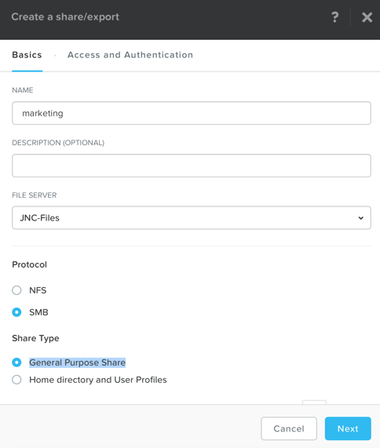
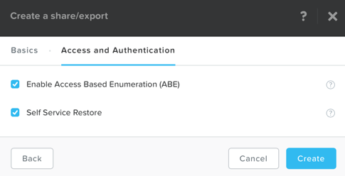
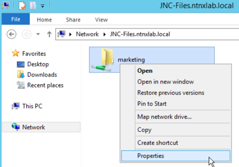
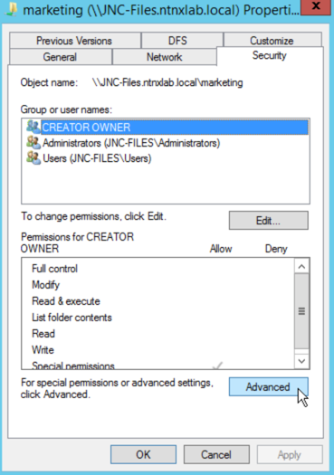
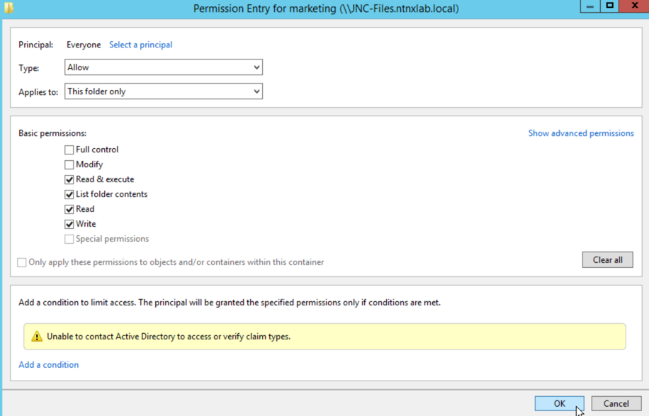
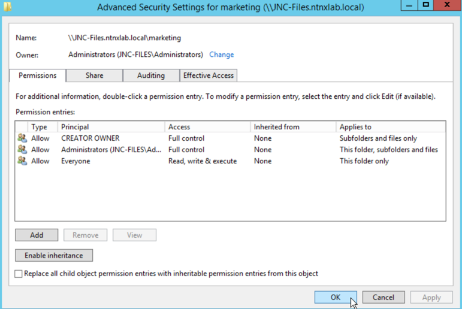
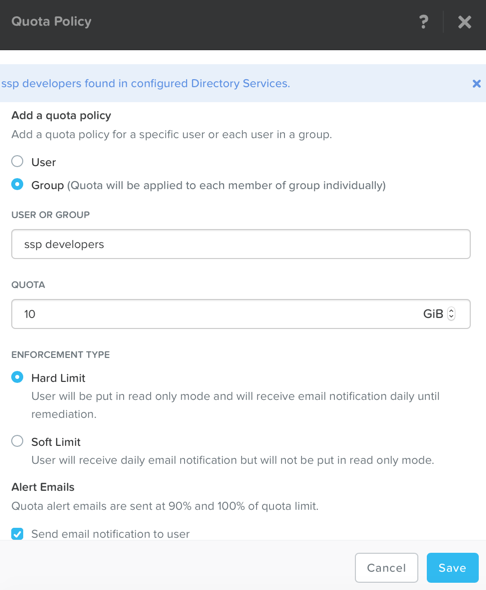

.. _files_smb_share:

----------------------------
Files: Create SMB Share
----------------------------

Overview
++++++++

.. note::

  Estimated time to complete: **1 HOUR**

In this exercise you will use Files to configure a SMB share.

Configuring SMB Home Share
++++++++++++++++++++++++++

In **Prism > File Server**, click **+ Share/Export**. Fill out the following fields and click **Next**:

  - **Name** - marketing
  - **Protocol** - SMB
  - **Share/Export Type** - General Purpose Share

Select **Enable Access Based Enumeration** and **Self Service Restore** and click **Create**.

Connect to SMB Share
++++++++++++++++++++

Windows VM for Testing SMB Share
................................

Use the **Windows2012-*initials* ** VM you created earlier in the "Deploying Workloads" lab.

If you have not deployed a Windows VM, follow this guide to deploy a Windows2012 VM:

In **Prism > VM > Table**, click **+ Create VM**.

Fill out the following fields and click **Save**:

- **Name** - SMB-Client-*intials*
- **Description** - Windows VM for testing Files SMB Shares
- **vCPU(s)** - 2
- **Number of Cores per vCPU** - 1
- **Memory** - 4 GiB
- Select **+ Add New Disk**

  - **Operation** - Clone from Image Service
  - **Image** - Windows2012R2
  - Select **Add**
- Select **Add New NIC**

  - **VLAN Name** - Primary
  - Select **Add**

Select the **SMB-Client-*intials* ** VM and click **Power on**.

Log into the VM and add it to the **ntnxlab.local** domain.

Connecting to SMB Share
.......................

.. note::

  You can use any Windows VM joined to the ntnxlab.local domain to complete the following steps.

Log into your Windows VM console, and open ``\\*intials*-Files.ntnxlab.local\`` in **File Explorer**.

Right-click **marketing > Properties**.

Select the **Security** tab and click **Advanced**.

Select **Users (*intials*-Files\\Users)** and click **Remove**.

Click **Add**.

Click **Select a principal** and specify **Everyone** in the **Object Name** field. Click **OK**.

.. figure:: images/files_smb_006.png

Fill out the following fields and click **OK**:

  - **Type** - Allow
  - **Applies to** - This folder only
  - Select **Read & execute**
  - Select **List folder contents**
  - Select **Read**
  - Select **Write**

Click **OK > OK > OK**.

In **Prism > File Server > Share > marketing**, click **+ Add Quota Policy**. Fill out the following fields and click **Save**:

  - Select **Groups**
  - **Users or Group** - SSP Developers
  - **Quota** - 10 GiB
  - **Enforcement Type** - Hard Limit

